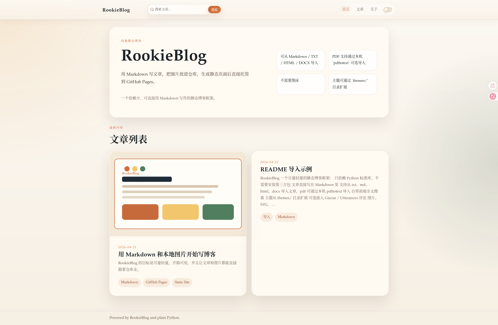
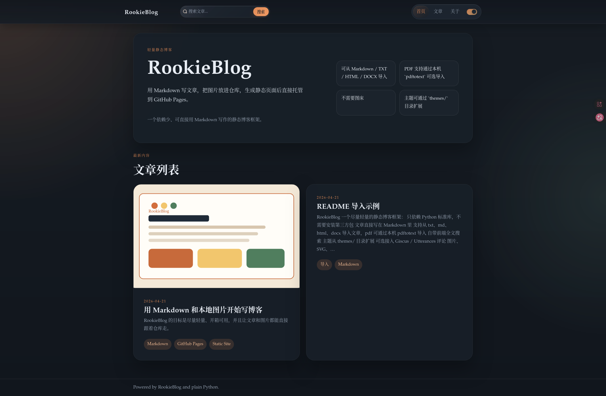

# RookieBlog

一个尽量轻量的静态博客框架：

- 只依赖 Python 标准库，不需要安装第三方包
- 文章直接写在 Markdown 里
- `content/posts/` 下的文件夹会自动作为文章分类
- 支持从 `txt`、`md`、`html`、`docx` 导入文章，`pdf` 可通过本机 `pdftotext` 导入
- 自带前端全文搜索
- 自带暗色模式开关
- 顶部提供独立的“文章”入口、分类页和文章阅读侧栏
- 主题从 `themes/` 目录扩展
- 可选接入 Giscus / Utterances 评论
- 图片、SVG、附件可以直接放仓库，不需要第三方图床
- 生成静态网页，适合部署到 GitHub Pages






## 目录结构

```text
RookieBlog/
├── content/
│   ├── assets/         # 图片、SVG、附件
│   ├── pages/          # 独立页面
│   └── posts/          # 博客文章，子文件夹会作为分类
├── static/             # 公共静态资源，如 favicon、额外素材
├── themes/             # 主题模板和样式
├── .github/workflows/  # GitHub Pages 自动部署
├── docs/               # 适用于 GitHub Pages /docs 来源的发布目录
├── rookieblog.py       # 生成器脚本
└── site.json           # 站点配置
```

## 快速开始

```bash
python3 rookieblog.py build
```

生成结果会输出到 `dist/`。

如果你当前的 GitHub Pages 仍然使用 `main` 分支下的 `/docs` 作为发布来源，可以再执行：

```bash
python3 rookieblog.py build-docs
```

这个命令会先生成 `dist/`，再同步到 `docs/`。

如果你想本地预览：

```bash
python3 rookieblog.py serve --port 8000
```

## 新建文章

```bash
python3 rookieblog.py new "我的第一篇文章"
```

它会在 `content/posts/` 下生成一篇带 front matter 的 Markdown 文件。

如果想直接放进分类文件夹：

```bash
python3 rookieblog.py new "NLP 的基础概念" --folder LLM
```

这样会生成到：

```text
content/posts/LLM/nlp-de-ji-chu-gai-nian.md
```

## 导入常见文档

```bash
python3 rookieblog.py import ./notes.docx --folder others --tags 导入,Word

or

python3 rookieblog.py import ./notes.docx --folder others
```

导入 PDF 也是一样：

```bash
python3 rookieblog.py import ./paper.pdf --folder LLM --tags 导入,PDF

or

python3 rookieblog.py import ./paper.pdf --folder LLM
```

支持：

- `txt`
- `md`
- `html` / `htm`
- `docx`
- `pdf`

说明：

- `pdf` 导入依赖本机安装 `pdftotext`
- 老式 `.doc` 建议先另存为 `.docx`
- `docx` 中的图片会自动导出到 `content/assets/imports/<slug>/`

也可以导入成独立页面：

```bash
python3 rookieblog.py import ./about.txt --page --title "关于本站"
```

## Markdown 元数据

每篇文章顶部都可以写简单的 front matter：

```md
---
title: 我的第一篇文章
date: 2026-04-21
summary: 这是文章摘要。
tags: [Markdown, GitHub Pages, Python]
cover: /assets/images/local-demo.svg
draft: false
---
```

## 使用本地图片

把图片放进仓库里，然后像普通 Markdown 一样引用即可。

例如：

```md

```

构建时会把 `content/` 里的非 Markdown 文件一起复制到 `dist/`，所以：

- `content/assets/` 里的图片会被一起带到输出目录
- 放在文章旁边的本地图片也能一起带过去
- 不需要使用第三方图片托管服务
- 推荐优先使用 `/assets/...` 这种站点内路径，这样文章以后移动到别的分类文件夹也不会丢图

## GitHub Pages 部署

仓库里已经附带了 `.github/workflows/pages.yml`，推送到 GitHub 后可以直接用 Actions 部署。

推荐步骤：

1. 把这个项目推到 GitHub。
2. 在仓库的 `Settings -> Pages` 中启用 `GitHub Actions` 作为部署来源。
3. 推送到 `main` 分支后，GitHub 会自动构建并发布 `dist/`。

如果仓库还在使用 `main` 分支下的 `/docs` 作为 Pages 来源，本地可以执行 `python3 rookieblog.py build-docs` 来生成发布目录。

## License

本项目使用 `MIT` 协议。

## 文章与页面

- 文章放在 `content/posts/**/*.md`
- 独立页面放在 `content/pages/*.md`
- `content/posts/` 下的子文件夹名会自动作为分类名
- 顶部导航里的“文章”会进入独立文章页
- 会自动生成分类页：`dist/categories/<分类>/index.html`
- 文章阅读页侧栏会显示当前分类下的其他文章
- 首页默认只展示 `content/posts/others/` 或 `content/posts/other/` 下的文章
- 会自动生成 `dist/search/index.html` 和 `dist/search-index.json`
- 文章主区域默认只显示 Markdown 正文本身，阅读页的大纲和同分类文章显示在侧栏

## 主题扩展

主题目录在 `themes/`。

默认主题包含：

```text
themes/default/
├── assets/
│   ├── theme.css
│   ├── search.js
│   └── theme-toggle.js
└── templates/
    ├── articles.html
    ├── base.html
    ├── category.html
    ├── home.html
    ├── page.html
    ├── post.html
    ├── post_card.html
    └── search.html
```

创建新主题的方式：

1. 复制 `themes/default` 为 `themes/你的主题名`
2. 修改模板和样式
3. 在 `site.json` 里设置 `"theme": "你的主题名"`

## 评论系统

当前支持：

- `giscus`
- `utterances`

在 `site.json` 的 `comments` 中配置即可。

例如启用 Giscus 时，需要填写：

```json
"comments": {
  "provider": "giscus",
  "repo": "WZY03DXZ/RookieBlog",
  "repo_id": "你的 repo_id",
  "category": "Announcements",
  "category_id": "你的 category_id",
  "mapping": "pathname",
  "theme": "preferred_color_scheme",
  "lang": "zh-CN"
}
```

如果暂时不想启用评论，保留 `"provider": ""` 即可。

## 适合这个框架的场景

- 想要一个比重量级 SSG 更简单的个人博客
- 更看重“容易安装和使用”
- 想用文件夹直接组织文章分类，而不是额外维护复杂配置
